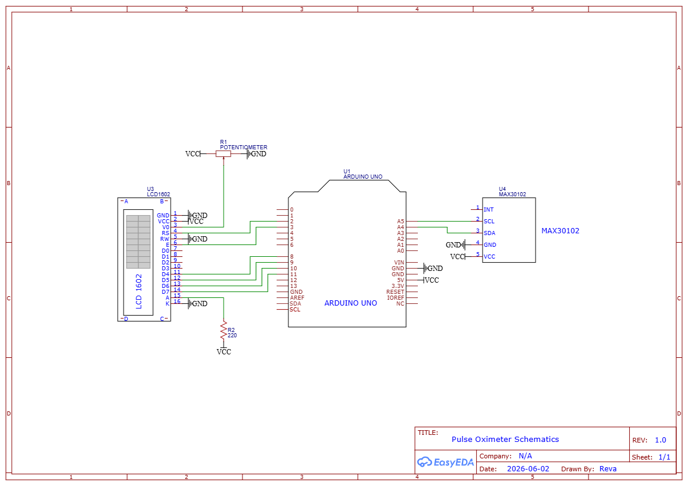

# Arduino Pulse Oximeter Project Overview
Arduino-based pulse oximeter with heart rate measurement, blood oxygen estimation, and LCD display.

## Components
- Arduino Uno R3 
- MAX30102 Module 
- LCD1602 Display 
- Breadboard 
- Jumper Wires
- Potentiometer
- 220 Ohm Resistor 

## Schematic 

## Installation 
- Install the SparkFun MAX30105 library to interface with the pulse oximeter sensor
- Install the LiquidCrystal library to enable control of the 16×2 LCD display

## Current Prototype Demo
(https://drive.google.com/file/d/1-y-36yLg5hr9LkGneLRxy3-ZZPQlt3wh/view?usp=sharing)

## Future Improvements
- Optimize the design by transitioning to an Arduino Nano and an I2C-enabled LCD display to reduce wiring complexity
- Design and 3D print a compact wearable enclosure for improved portability and usability
- Enhance signal processing by implementing more advanced filtering techniques to improve the accuracy and stability of SPO2 and BPM (especially) readings
- Calibrate SPO2 calculations more accurately 