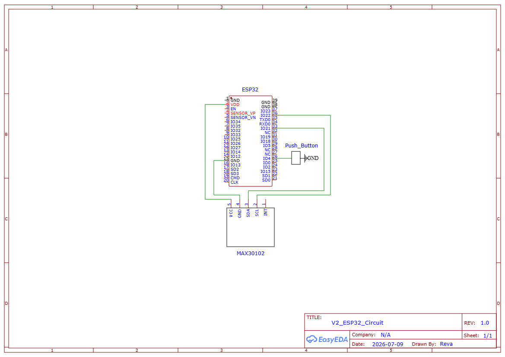

# Biomedical Pulse Oximeter Project Overview
A wearable pulse oximeter prototype designed to measure heart rate (BPM) and estimate blood oxygen saturation (SpO₂) using the MAX30102 optical sensor. The project began as an Arduino Uno-based prototype to validate sensor integration and signal processing before transitioning toward a smaller ESP32-based wearable design.

## Version 1

### Components
- Arduino Uno R3 
- MAX30102 Module 
- LCD1602 Display 
- Breadboard 
- Jumper Wires
- Potentiometer
- 220 Ohm Resistor 

### Schematic 

### Installation 
- Install the SparkFun MAX30105 library to interface with the pulse oximeter sensor
- Install the LiquidCrystal library to enable control of the 16×2 LCD display

### Prototype Demo
(https://drive.google.com/file/d/1-y-36yLg5hr9LkGneLRxy3-ZZPQlt3wh/view?usp=sharing)

### Future Improvements
- Optimize the design by transitioning to an Arduino Nano/other compact microcontroller and another form of display to reduce wiring complexity
- Design and 3D print a compact wearable enclosure for improved portability and usability
- Enhance signal processing by implementing more advanced filtering techniques to improve the accuracy and stability of SPO2 and BPM (especially) readings
- Calibrate SPO2 calculations more accurately 

## Version 2

### Components
- ESP32
- MAX30102 Module 
- 5cm x 7cm Perfboard 
- Silicone Stranded Wires + Headers/Pins
- Button  

### Schematic

### Installation
- Install the SparkFun MAX30105 library to interface with the pulse oximeter sensor
- Install the Espressif Systems ESP32 Board Package on Arduino IDE 

### Prototype Demo
(https://drive.google.com/file/d/1u03q-FAOlaQ1Nc74aSsSCzLkurTRyO_L/view?usp=sharing)
- **Note:** The video may appear blurry due to compression during upload. The original video is clear.

### Future Improvements
- Make the electronics even more compact using a custom PCB 
- Make the enclosure more enclosed, comfortable, and ergnomic for the user
- Customize the straps to work for people of all sizes
- Calibrate the SPO2 calculations